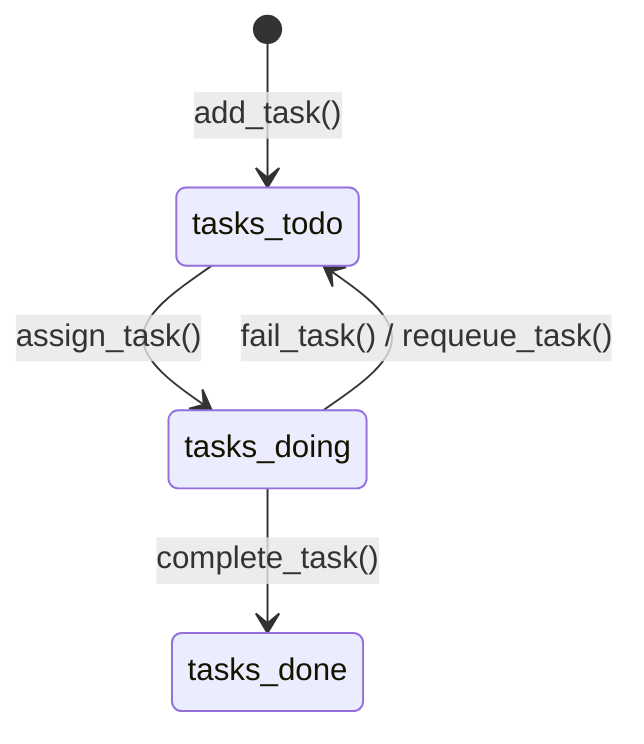

# Especificação de Design: Gerenciador de Filas Distribuídas com Tolerância a Falhas

Esta especificação define as melhorias arquiteturais e de protocolo para transformar o sistema distribuído master-worker atual em um gerenciador de filas distribuídas tolerante a falhas.

## 1. Alterações Arquiteturais

### 1.1 Controle de Estado do Ciclo de Vida das Tasks
Atualmente, as tarefas são armazenadas em listas simples no servidor. Introduziremos uma representação formal de `Task` e uma classe `TaskManager` thread-safe para gerenciar três estados de tarefas:
- `tasks_todo`: Tarefas aguardando processamento.
- `tasks_doing`: Tarefas atualmente em execução por algum worker.
- `tasks_done`: Tarefas concluídas com sucesso.



#### Estrutura da Task (Dataclass)
Definiremos uma dataclass `Task`:
```python
@dataclass
class Task:
    name: str
    status: str = "todo"                      # "todo", "doing", "done"
    worker_uuid: Optional[str] = None         # Worker responsável pela tarefa
    start_time: Optional[str] = None          # Timestamp (formato ISO) de início
    server_uuid: Optional[str] = None         # Servidor atualmente responsável
```

#### Interface da TaskManager
```python
class TaskManager:
    def __init__(self, initial_tasks: list, server_uuid: str):
        self.lock = threading.Lock()
        self.server_uuid = server_uuid
        self.tasks_todo = [...]
        self.tasks_doing = {}  # worker_uuid -> Task
        self.tasks_done = []
```

### 1.2 Heartbeat & Monitoramento de Workers
Para detectar falhas ou isolamento de rede dos workers, implementaremos um mecanismo de heartbeat:
- **Thread de Heartbeat no Worker**: O worker iniciará uma thread em segundo plano `heartbeat_loop()` que enviará periodicamente uma mensagem de ping (`{"HEARTBEAT": "PING", "WORKER_UUID": "..."}`) diretamente pelo socket compartilhado. Um lock `socket_lock` garantirá que os envios de heartbeat não se misturem aos dados enviados pela thread principal de processamento do worker.
- **Heartbeat Unidirecional**: O heartbeat será um envio simples do worker para o servidor, sem resposta do servidor. Isso evita condições de corrida no lado do cliente onde a thread principal e a thread de heartbeat tentam ler concorrentemente do mesmo socket.
- **Registro de Heartbeat no Servidor**: O servidor registrará o timestamp `last_heartbeat` para cada worker ativo.
- **Thread de Monitoramento no Servidor**: O servidor executará uma thread em segundo plano `monitor_workers_loop()`. Se o último heartbeat de um worker for mais antigo que `HEARTBEAT_TIMEOUT` (padrão: 10 segundos), o servidor marcará o worker como morto:
  1. Devolve a tarefa ativa (move de `tasks_doing` para `tasks_todo`).
  2. Fecha a conexão do socket do worker para interromper leituras travadas.
  3. Limpa todas as referências do worker em `local_workers`, `busy_workers`, `borrowed_workers`, `pending_redirects` e `pending_releases`.
  4. Se o worker morto era emprestado, envia uma notificação `worker_dead` ao servidor de origem.

### 1.3 Balanceamento de Carga & Empréstimo/Devolução de Workers
- **Estado Saturado**: Um servidor estará saturado quando `carga > CAPACITY` (onde `carga = len(tasks_todo) + len(tasks_doing)`).
- **Proporção de Ajuda**: A quantidade de workers solicitada aos peers será calculada por `calculate_workers_needed() = max(1, carga - CAPACITY)`.
- **Devolução de Workers (Release)**: Workers emprestados serão devolvidos apenas se estiverem **ociosos** (idle, isto é, fora de `tasks_doing`) e a carga do master que os emprestou voltar abaixo de `RELEASE_THRESHOLD`. Se um worker emprestado morrer, o servidor que o tomou emprestado notificará o master de origem.

---

## 2. Alterações de Protocolo

### 2.1 Envio de Heartbeat do Worker
- Direção: Worker $\rightarrow$ Servidor
- Mensagem:
  ```json
  {"HEARTBEAT": "PING", "WORKER_UUID": "W-1"}
  ```

### 2.2 Notificação de Morte de Worker (M2M)
- Direção: Servidor Emprestador $\rightarrow$ Servidor de Origem
- Mensagem:
  ```json
  {
    "type": "worker_dead",
    "request_id": "uuid-unico",
    "payload": {
      "worker_id": "W-1"
    }
  }
  ```

---

## 3. Padronização de Logs
Todos os logs do sistema seguirão estritamente o formato:
`[TIMESTAMP] [TIPO] mensagem`

Tipos (`TIPO`):
- `[HEARTBEAT]` - Heartbeats recebidos/processados
- `[WORKER_DEAD]` - Worker detectado como inativo/morto
- `[REQUEUE]` - Task devolvida à fila devido a falhas
- `[TASK_COMPLETED]` - Task finalizada com sucesso
- `[REDIRECT]` - Redirecionamento de worker iniciado
- `[RELEASE]` - Liberação/devolução de worker iniciada
- `[SATURATION]` - Saturação de capacidade detectada
- `[LEND]` - Worker emprestado para outro servidor
- `[RETURN]` - Worker retornado do empréstimo
- `[RECONNECT]` - Tentativa de conexão/reconexão de worker
- `[DISPATCH]` - Envio de tarefa para processamento
